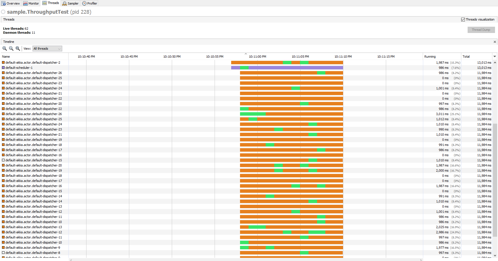
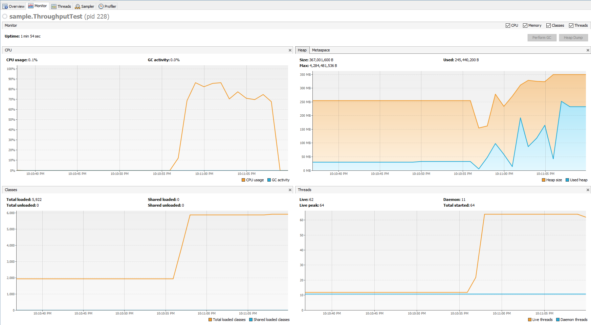

***Word Count Web Service Sample***

The only thing you will need to run this application is sbt.

Issue an "sbt test" to run the automated unit tests.

Issue an "sbt run" and select "sample.RunnableWebService" to start the webserver (localhost:8080)

Issue an "sbt run" and select "sample.ThroughputTest" to run an automated throughput test.
 The throughput test starts the webserver and streams the sample lorem ipsum text through 
 the web service using the akka http client.

There is also a bash script under bin/ that that uses curl to post the sample file to the web service.

***Performance***

While running the throughput test:

The worker threads appear to spend most of their time in the parked state.
 I'm not sure if this is due to an overallocation of threads by Akka.

The test was able to saturate my CPU (quad core Skylake) to 80-90%

I was unable to generate or export jvm snapshots with jvisualvm using my home workstation.

I suspect this might have something to do with me running sbt under the git/mingw/bash shell (windows).

I tried altering the build to fork the application into a separate process, it did not help.

The throughput test only sees a 20-25% latency improvement when issuing empty request bodies in lieu
 of the sample text. Therefore most of the processing time is probably Akka handling HTTP requests, 
 and the added overhead of the http client which is running under the same JVM.

If I were to optimize a solution utilizing this service I would probably focus on the client not the server.

Tweaking the connection pooling and concurrency on both the server and client could improve matters.

I've always been impressed with the concurrency capabilities of the Akka Streams library,
 it reminds me of working with the C#/CLR Parallel library.
